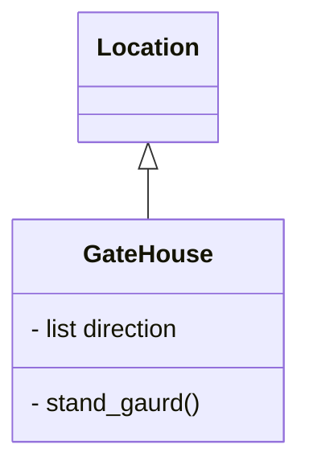

# Game Name
`Your details` 
`This is a single player, adventure text-based game` 
  
Basic Mark down, this can be removed 
# Main heading
## Second level heading
### Third level heading
**Bold**  
***Bold and Italic***
- [ ] Lists
- bullets  
[python:download](https://www.python.org/downloads/) Hyperlinks
> text in a box
> 
`> Another type of text box`

## Introduction

## User Documentation
#### Overview and rules

#### Game play

## Developer Documentation
### Files and resources

### User Requirements Specification

#### Class Diagram

